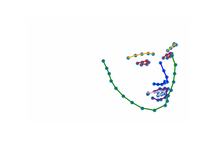
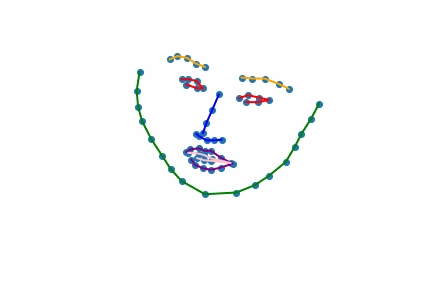
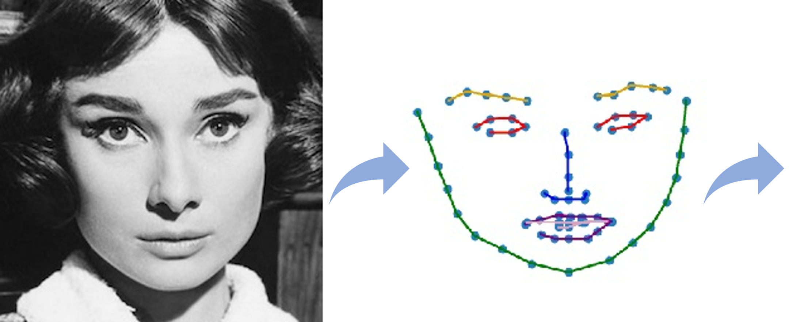
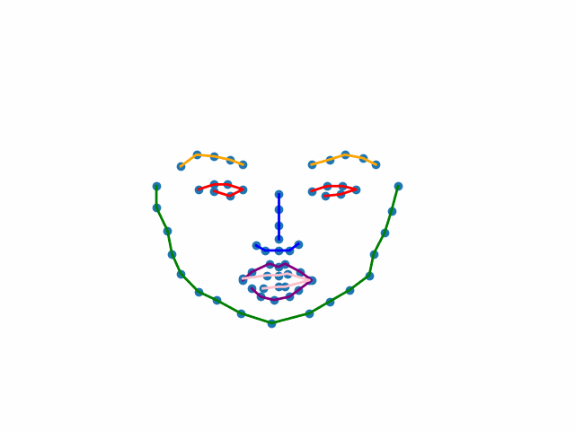
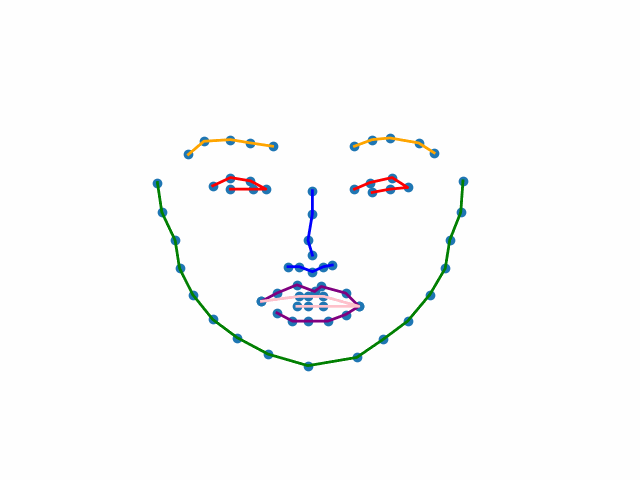
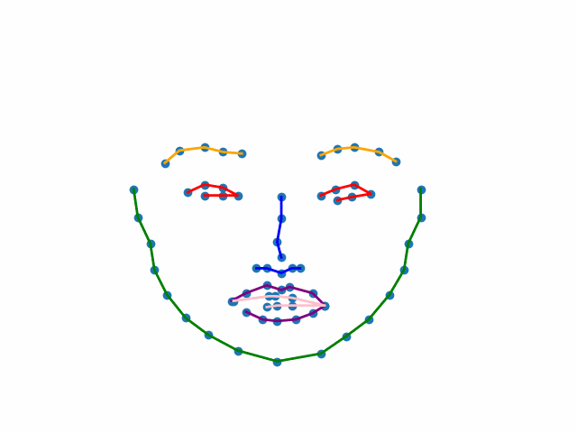

# Autoregressive GAN for Semantic Unconditional Head Motion Generation (SUHMo)

## Abstract

We address the task of unconditional head motion generation to animate still human faces in a low-dimensional semantic space.
Deviating from talking head generation conditioned on audio that seldom puts emphasis on realistic head motions, we devise a GAN-based architecture that allows obtaining rich head motion sequences while avoiding known caveats associated with GANs.
Namely, the autoregressive generation of incremental outputs ensures smooth trajectories, while a multi-scale discriminator on input pairs drives generation toward better handling of high and low frequency signals and less mode collapse.
We demonstrate experimentally the relevance of the proposed architecture and compare with models that showed state-of-the-art performances on similar tasks. 

## Architecture overview

## Demo

In the results presented below **120 frames** are generated from a **single** reference image.

### SUHMo-RNN (Training on CONFER DB)

     
     
 

### SUHMo-Transformer (Training on VoxCeleb2)

     
     

<!-- ### Comparison with ACTOR model

#### Training on CONFER DB

   
  

#### Training on VoxCeleb2

   
  
 -->

### SUHMo in-the-wild

Several outputs can be obtained from the same reference image. See below for an illustration on SUHMo-RNN trained on CONFER DB.

 

 
## Citation

## References

#### Face Alignment
_A. Bulat and G. Tzimiropoulos, “How far are we from solving the 2d & 3d face alignment problem? (and a dataset of 230,000 3d facial landmarks),” in ICCV, 2017._
<!--  #### ACTOR
_M. Petrovich, M. J Black, and G. Varol, “Action-conditioned 3d human motion synthesis with transformer vae,” in ICCV, 2021._ -->
#### CONFER DB
_C. Georgakis, Y. Panagakis, S. Zafeiriou, and M. Pantic, “The conflict escalation resolution (confer) database,” Image and Vision Computing, vol. 65, 2017._
#### VoxCeleb2
_J. S. Chung, A. Nagrani, and A. Zisserman, “Voxceleb2: Deep speaker recognition,” in INTERSPEECH, 2018._
