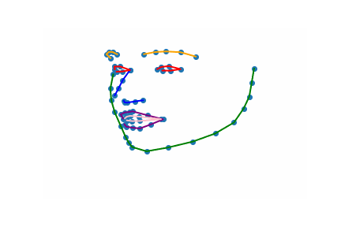

# Autoregressive GAN for Semantic Unconditional Head Motion Generation (SUHMo)

## Abstract

We address the task of unconditional head motion generation to animate still human faces in a low-dimensional semantic space.
Deviating from talking head generation conditioned on audio that seldom puts emphasis on realistic head motions, we devise a GAN-based architecture that allows obtaining rich head motion sequences while avoiding known caveats associated with GANs.
Namely, the autoregressive generation of incremental outputs ensures smooth trajectories, while a multi-scale discriminator on input pairs drives generation toward better handling of high and low frequency signals and less mode collapse.
We demonstrate experimentally the relevance of the proposed architecture and compare with models that showed state-of-the-art performances on similar tasks. 

## Architecture overview

## Demo

1 reference pose --> 120 predicted frames

### SUHMo RNN - Training on CONFER DB

     
     

### SUHMo RNN - Training on VoxCeleb2

     
     

### Comparison with ACTOR model

#### Training on VoxCeleb2
   
